# 🛍️ Modern E-Commerce Application

⚡𝓛𝓮𝓰𝓮𝓷𝓭💫⚡

Welcome to the **React + Vite E-Commerce Application**. This repository contains a fully-featured client storefront coupled with an administrative panel and secure payment processing capabilities.

---

## 🏗️ System Architecture & Component Hierarchy

The following diagram maps the frontend component views, state management provider relationships, routing, and api communication flows.

```mermaid
%%{init: {
  'theme': 'base',
  'themeVariables': {
    'background': '#0f172a',
    'primaryColor': '#312e81',
    'primaryTextColor': '#f8fafc',
    'primaryBorderColor': '#4338ca',
    'lineColor': '#94a3b8',
    'secondaryColor': '#1e293b',
    'tertiaryColor': '#0f172a',
    'mainBkg': '#1e293b',
    'nodeBorder': '#334155',
    'textColor': '#f1f5f9'
  }
}}%%
flowchart TD
  %% Frontend Architecture Subgraph
  subgraph Client ["Frontend Architecture (React + Vite)"]
    direction TB
    App["App.jsx (React Router)"] --> Shell["Layout Shell"]
    
    Shell --> Navbar["Navbar.jsx (Header)"]
    Shell --> Footer["Footer.jsx (Footer)"]
    Shell --> Toaster["Toaster (Notifications)"]
    
    App --> Public["Public & Info Pages"]
    subgraph Public ["Public & Info Pages"]
      Home["Home.jsx (Landing Page)"] --> Hero["Hero Banner Section"]
      Home --> Featured["Featured Products / Promos"]
      About["About.jsx (Company Info)"]
      Contact["Contact.jsx (Support Form)"]
    end
    
    App --> Catalog["Product Catalog & Discovery"]
    subgraph Catalog ["Product Catalog & Discovery"]
      Menu["Menu.jsx / ProductDetails.jsx"]
      Food["Food.jsx (Food Category)"]
      Food2["Food2.jsx (Menu List 2)"]
    end
    
    App --> Auth["Identity & Access Management"]
    subgraph Auth ["Identity & Access Management"]
      Login["Login.jsx"] --> OTP["OTP.jsx (Verification)"]
      Register["Register.jsx"]
      Forgot["ForgotPassword.jsx"]
      Logout["Logout.jsx"]
    end
    
    App --> Transact["Checkout & User Space"]
    subgraph Transact ["Checkout & User Space"]
      Cart["Cart.jsx (Shopping Cart)"]
      Liked["Liked.jsx (Wishlist)"]
      Payment["Payment.jsx (Stripe/Gateway)"] --> Success["Success.jsx (Receipt)"]
      Orders["Orders.jsx (History)"]
      Profile["Profile.jsx (Dashboard)"] --> ProfileChange["Profilechance.jsx"]
    end
    
    App --> Admin["Administration"]
    subgraph Admin ["Administration"]
      Upload["AdminUpload.jsx (Add Items)"]
    end

    CartContext["CartContext.jsx (Context API)"] -.->|Provides Cart State| Cart
    CartContext -.->|Provides Cart State| Menu
    CartContext -.->|Provides Cart State| Navbar
  end

  %% Backend System Subgraph
  subgraph Server ["Backend Services"]
    direction TB
    Express["Express Server (API Gateway)"]
    DB[("MongoDB Database")]
    Express --> DB
  end

  %% API Interactions
  Catalog -->|HTTP GET /products| Express
  Auth -->|HTTP POST /auth| Express
  Transact -->|HTTP POST /orders| Express
  Admin -->|HTTP POST /upload| Express

  %% Styling Definitions
  classDef appNode fill:#4f46e5,stroke:#4338ca,stroke-width:2px,color:#ffffff;
  classDef contextNode fill:#06b6d4,stroke:#0891b2,stroke-width:2px,color:#ffffff;
  classDef dbNode fill:#10b981,stroke:#059669,stroke-width:2px,color:#ffffff;
  classDef shellNode fill:#64748b,stroke:#475569,stroke-width:2px,color:#ffffff;
  classDef apiNode fill:#f59e0b,stroke:#d97706,stroke-width:2px,color:#ffffff;

  class App appNode;
  class CartContext contextNode;
  class DB dbNode;
  class Express apiNode;
  class Navbar,Footer,Toaster shellNode;
```



---

## 🔄 End-to-End User Journey

This flow outlines the user lifecycle checkout journey, from initial landing to final transaction fulfillment:


---

## ⭐ Core Features

- 🖥️ **Hero Banner & Home Experience**: Engaging promotional banners and links directly routing to top catalog sections.
- 🍔 **Product Catalog**: Multiple categorization matrices (`Food`, `Food2`, `Menu`) and a product detail view for rich interaction.
- 🛒 **Shopping Cart & State Provider**: Synchronized globally via the custom React Context.
- 🔒 **Secure Payment Processing**: Handles checkout gateways and verification.
- 📦 **Order Management**: Real-time status update list and history dashboard.
- 🛡️ **User Identity**: Built-in verification (OTP) and login retrieval mechanics.

---

## 🛠️ Project Setup

### Installation
1. Clone the repository:
   ```bash
   git clone <repository_url>
   ```
2. Navigate to the frontend directory:
   ```bash
   cd frontend
   ```
3. Install dependencies:
   ```bash
   npm install
   ```

### Running Locally
To launch the development server with HMR:
```bash
npm run dev
```
